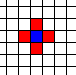
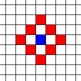
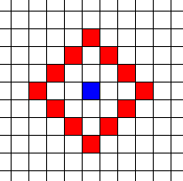
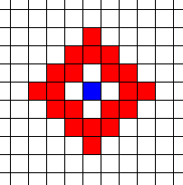
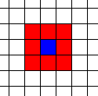

grid_engine
===========
**Grid Engine is not (as of 02013-04-10) yet ready for public use.**

**grid_engine** is a class for flexibily working with different kinds of two-dimensional grids.

It can handle hexagonal, 4-connected, and 8-connected grids.

Any of these connectivities can be used in a toroidal fashion, such that the edges of the grid wrap around.

Getting Started
===============

First Steps
-----------
 1. Download and unpack the code.

 2. By default the code provides neighbours at distances from 0-100 from a
    central cell. If this makes you happy, skip to Step 

 3. If you are not happy with this default, you will need to rebuild the code:

    make nsize=100

    Change 100 to suit your needs. Remember, larger neighbourhood sizes will
    increase the size of your executable.

 4. The code will run its test suite. If it passes, continue. If not, panic.

 5. Move the files **grid_engine.h** and **grid_engine_neighbours.h** into your
    project directory. The second file is included in the first and should not
    be included directly by your project.

 6. Use `#include "grid_engine.h"` to import grid_engine into your project.

Creating a Grid
---------------
It is best to use a line analogous to

    typedef grid_engine::grid_engine<int> gtype;

in order to save yourself typing and decrease visual noise in your code.

To define a new grid 40 cells wide and 50 cells high use:

    gtype grid(40,50);

To define a new grid with all cells set to 3 use:

    gtype grid(40,50,3);

Parsing a Grid
--------------
To do something to every cell in a grid, we create a **parser**. Parsers can be
used in **for** loops, like so:

    //Give every cell a random number
    for(gtype::parser i=grid.begin();i.good();++i){
      *i=rand();
      cout<<"Cell "<<i.x()<<","<<i.y()<<" has a value of "<<*i<<endl;
    }

A parser can also be used to look up values in a second grid:

    gtype grid1(40,40), grid2(40,40);
    for(gtype::parser i=grid.begin();i.good();++i){
      cout<<"Cell "<<i.x()<<","<<i.y()<<" has a value of "<<*i<<" in grid 1";
      cout<<" and a value of "<<grid2(i)<<" in grid 2."<<endl;
    }

Neighbours
----------
To do something to neighbours of cells in a grid, we use a **nparser**.
Nparsers can be used in **for** loops, like so:

    //Set each cell in the grid to the sum of itself and its D8 neighbours at
    // distance 1
    for(gtype::parser i=grid.begin();i.good();++i)
      for(gtype::nparser n=i.d8ring(1);n.good();++n)
        *i+=*n;

Naturally, an nparser can be used to refer to cells in a second grid:

    //Set each cell in the second grid to the sum of the D8 neighbours
    //at distance 1 from its corresponding cell in the first grid
    grid2.fill(0); //Make every cell a 0
    for(gtype::parser i=grid2.begin();i.good();++i)
      for(gtype::nparser n=i.d8ring(1);n.good();++n)
        *i+=grid(n);

Types of Neighbourhoods
=======================
There are three types of neighbourhoods or connectivities: D4, D8, and Hex.

D4
---------------
A D4 neighbourhood is one in which cells can only be accessed by moving
vertically and horizontally, but not diagonally. Like so:

To generate a D4 neighbourhood, use `d4ring(Distance)`, where _Distance_ is the
distance of the neighbouring cells from the central cell, using D4
connectivity.

You can also use `d4ring(Inner,Outer)`, where _Inner_ is the distance from the
central cell to an inner ring of neighbouring cells and _Outer_ is the distance
from the central cell to an outer ring of neighbouring cells. Together,
_Inner_ and _Outer_ define an inclusive range of neighbouring rings.

For instance, the neighbourhood above was produced with `d4ring(1)`.

`d4ring(2)` would produce:

while `d4ring(3)` would produce:

and `d4ring(2,3)` produces:

D8
---------------
A D8 neighbourhood is one in which cells can only be accessed by moving
vertically and horizontally, as well as diagonally. Like so:

To generate a D8 neighbourhood, use
`d8ring(Distance)` or `d8ring(Inner,Outer)`.

Hex
---------------
A Hex neighbourhood is one in which cells can only be accessed by moving
outward from a central hexagonal cell. Like so:

To generate a Hex neighbourhood, use
`hexring(Distance)` or `hexring(Inner,Outer)`.

Examples
========

    :::c++
    //Define a an integer grid type
    typedef grid_engine::grid_engine<int> gtype;

    //Define two 40x40 grids of integers
    gtype grid(40,40), grid2(40,40);

    //Set each cell in the grid to a random number
    for(gtype::parser i=grid.begin();i.good();++i)
      *i=rand();

    //Set each cell in the second grid to the sum of the D8 neighbours
    //at distance 1 from its corresponding cell in the first grid
    grid2.fill(0);
    for(gtype::parser i=grid2.begin();i.good();++i)
      for(gtype::nparser n=i.d8ring(1);n.good();++n)
        *i+=grid(n);

    //Set each cell in the second grid to the sum of the D8 neighbours
    //at distance 2 from its corresponding cell in the first grid
    grid2.fill(0);
    for(gtype::parser i=grid2.begin();i.good();++i)
      for(gtype::nparser n=i.d8ring(2);n.good();++n)
        *i+=grid(n);

    //Set each cell in the second grid to the sum of the D8 neighbours
    //at distances 2-3 (inclusive) from its corresponding cell in the first
    //grid
    grid2.fill(0);
    for(gtype::parser i=grid2.begin();i.good();++i)
      for(gtype::nparser n=i.d8ring(2,3);n.good();++n)
        *i+=grid(n);

    //Set each cell in the second grid to the sum of the D8 neighbours
    //at distances 1 from its corresponding cell in the first
    //grid, assuming that the grid is a toroid
    grid2.fill(0);
    for(gtype::parser i=grid2.begin();i.good();++i)
      for(gtype::nparser n=i.d8tring(1);n.good();++n)
        *i+=grid(n);

    //Set each cell in the second grid to the sum of the D4 neighbours
    //at distance 1 from its corresponding cell in the first grid
    grid2.fill(0);
    for(gtype::parser i=grid2.begin();i.good();++i)
      for(gtype::nparser n=i.d4ring(1);n.good();++n)
        *i+=grid(n);

    //Set each cell in the second grid to the sum of the hexagonal neighbours
    //at distance 1 from its corresponding cell in the first grid
    grid2.fill(0);
    for(gtype::parser i=grid2.begin();i.good();++i)
      for(gtype::nparser n=i.hexring(1);n.good();++n)
        *i+=grid(n);

Notes
=====
The hexagonal data is stored in a 2D rectangular grid which is internally mapped to a hexagonal space. This mapping shifts columns with odd x-coordinates down a half-cell with respect to columns with even x-coordinates. The user should not normally need to worry about this.
